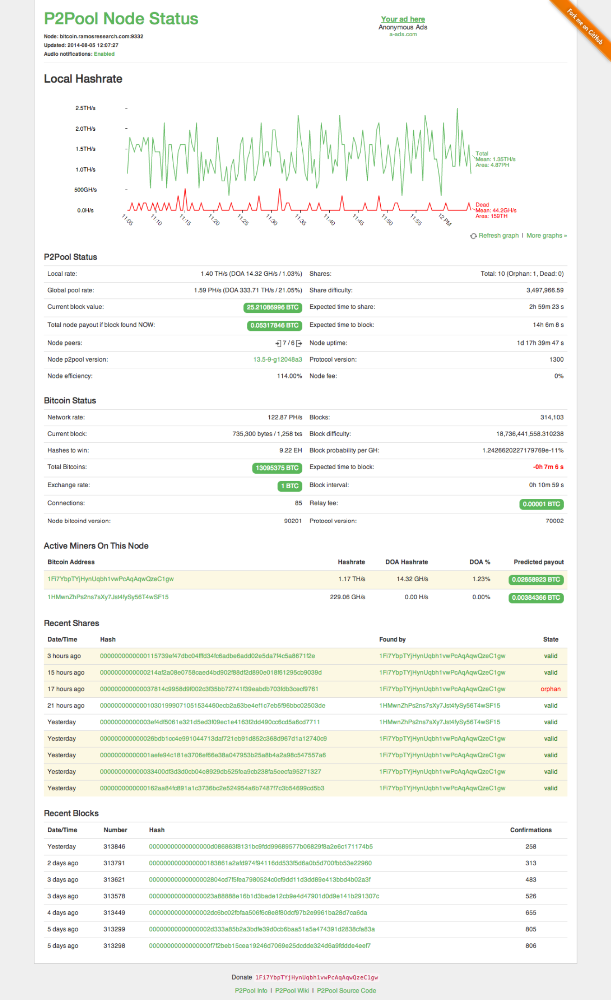

p2pool-node-status
==================

A clean p2pool node dashboard. It provides:

* Audio and text notifications for new shares and blocks (on most modern browsers)
* Automatic conversion of BTC to USD
* Integration with [Blockchain.info](https://blockchain.info/) APIs
* Detailed information about each share, block and transaction
* All the graphs you know and love

### Screenshot



### [Full demo here](http://bitcoin.ramosresearch.com)

## Note

This dashboard requires the use of a custom p2pool fork (https://github.com/jramos/p2pool). The fork adds additional web interfaces for retrieving block and transaction information.

## Installation

Do this in the top directory of your p2pool installation:

``` Bash
git submodule update
```

and access via `http://<url-to-your-p2pool>:<port>/static`. The default port is ``9332``.

## Configuration

The `config.json` is found in the `js` directory.

### Highlight your own miner address

If you want your miner address highlighted, adjust `myself` variable accordingly. E. g.

``` JavaScript
var config = {
  myself : [
    "1Fi7YbpTYjHynUqbh1vwPcAqAqwQzeC1gw"
  ],
  node_name : '',
  reload_interval : 60,
  reload_chart_interval : 600,
  convert_bitcoin_to_usd: true,
  enable_audio : true,
  header_url : '',
  footer_url : '',
  ad_url     : ''
}
```

### Customize the node name

By default. no node name is displayed. To customize, set `node_name` equal to the value you want to display. Note that this does not affect the host setting in any way.

``` JavaScript
var config = {
  myself : [],
  node_name : 'bitcoin.ramosresearch.com:9332',
  reload_interval : 60,
  reload_chart_interval : 600,
  convert_bitcoin_to_usd: true,
  enable_audio : true,
  header_url : '',
  footer_url : '',
  ad_url     : ''
}
```

### Adjust the reload intervals

By default the UI updates the miner list and server stats every 60 seconds.  You can adjust the `reload_interval` variable like this...

``` JavaScript
var config = {
  myself : [],
  node_name : '',
  reload_interval : 20,
  reload_chart_interval : 1200,
  convert_bitcoin_to_usd: true,
  enable_audio : true,
  header_url : '',
  footer_url : '',
  ad_url     : ''
}
```

to set it to 20 seconds for example.

`reload_chart_interval` sets the amount of seconds until the hashrate graph is reloaded.  In above example, it's configured to 1200 seconds (20 minutes).

**Beware** that each API query puts network and CPU load on your p2pool installation.  Avoid decreasing this value too much.

### Bitcoin currency conversion

By default, Bitcoin values are automatically converted to US dollars. This is accomplished by using real-time data from [Blockchain.info](https://blockchain.info/). To disable this feature, set the value of `convert_bitcoin_to_usd` to `false`.

``` JavaScript
var config = {
  myself : [],
  node_name : '',
  reload_interval : 60,
  reload_chart_interval : 600,
  convert_bitcoin_to_usd: false,
  enable_audio : false,
  header_url : '',
  footer_url : '',
  ad_url     : ''
}
```

### Disable audio notifications

By default, audio is played when new shares or blocks are discovered. This can be disabled via the `enable_audio` configuration option. Set it to false if you don't want to hear audio notifications.

``` JavaScript
var config = {
  myself : [],
  node_name : '',
  reload_interval : 60,
  reload_chart_interval : 600,
  convert_bitcoin_to_usd: true,
  enable_audio : false,
  header_url : '',
  footer_url : '',
  ad_url     : ''
}
```

### Display a header, footer and ads

Add HTML to the files references by `header_url`, `footer_url` and `ad_url` to display HTML snippets at the top, bottom and top-right of each page. Leave blank to disable.

``` JavaScript
var config = {
  myself : [],
  node_name : '',
  reload_interval : 60,
  reload_chart_interval : 600,
  convert_bitcoin_to_usd: true,
  enable_audio : true,
  header_url : 'header.html',
  footer_url : 'footer.html',
  ad_url     : 'ad.html'
}
```

## Donate

If you find this dashboard useful, please consider donating some bitcoins:

* Alexander Zschach, `1MzFr1eKzLEC1tuoZ7URMB7WWBMgHKimKe`
* Justin Ramos, `1Fi7YbpTYjHynUqbh1vwPcAqAqwQzeC1gw`

## License

Code released under [the MIT license](LICENSE.txt).
